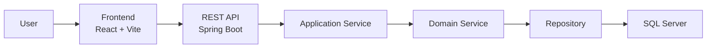

# 🎓 Club Management System

> A full-stack club management platform for student organizations and academic clubs.  
> The system supports member management, event organization, finance tracking, resource/document workflows, notifications, dashboard reporting, account management, and system settings.

<p align="center">
  
  
  
  
  
</p>

## 📚 Table of Contents

- [Overview](#-overview)
- [System Architecture](#-system-architecture)
- [Tech Stack](#tech-stack)
- [Environment Requirements](#environment-requirements)
- [Project Structure](#project-structure)
- [Installation and Setup](#installation-and-setup)
- [Sample Accounts](#sample-accounts)
- [Contributors](#-contributors)
- [License](#license)

## 📖 Overview

Club Management System is a modern full-stack application built for university clubs and student organizations.

The project focuses on solving common operational problems such as:

- Member registration, approval, search, filtering, and profile management
- Event creation, registration, attendance, organizer assignment, and evaluation
- Income, expense, revenue, and member due tracking
- Resource/document submission, review, approval, and file attachment workflows
- Notification delivery and recipient tracking
- Dashboard reporting, account management, and system settings

The architecture separates frontend and backend clearly for better scalability, maintainability, and testing.

## 🏗️ System Architecture



## Tech Stack

### Backend

- Java 17
- Spring Boot 4.0.2
- Spring Data JPA
- SQL Server
- Maven Wrapper

### Frontend

- React 19
- Vite 7
- React Router
- Zustand
- TanStack Query
- Axios

## Environment Requirements

Install the following tools before running the project:

- Java Development Kit 17+
- Node.js 20+
- npm 10+
- SQL Server or SQL Server Express
- Git

Verify the installed versions:

```bash
java -version
node -v
npm -v
git --version
```

## Project Structure

```text
SE104.Q21-club_management_system/
├── Backend/
│   ├── src/main/java/com/example/demo/
│   ├── src/main/resources/application.properties
│   ├── mvnw
│   ├── mvnw.cmd
│   └── pom.xml
├── Frontend/
│   ├── public/
│   ├── src/
│   ├── index.html
│   └── package.json
├── package.json
├── LICENSE
└── README.md
```

## Installation and Setup

### 1. Clone project

```bash
git clone https://github.com/ThankTran/club-management.git
cd club-management
```

If the source code is already available on your machine, open a terminal at the project root directory.

### 2. Create the database

Open SQL Server Management Studio or your preferred SQL Server client, connect to your local SQL Server instance, then run:

```sql
CREATE DATABASE clubmanage;
```

The backend database connection is configured in:

```text
Backend/src/main/resources/application.properties
```

Default configuration:

```properties
spring.datasource.url=jdbc:sqlserver://localhost:1433;databaseName=clubmanage;integratedSecurity=true;encrypt=true;trustServerCertificate=true;sendStringParametersAsUnicode=true
spring.datasource.driver-class-name=com.microsoft.sqlserver.jdbc.SQLServerDriver
spring.jpa.hibernate.ddl-auto=update
server.port=8081
```

The project uses Windows Authentication for SQL Server by default. If your machine uses a SQL Server account, update `spring.datasource.url`, `spring.datasource.username`, and `spring.datasource.password` accordingly.

### 3. Install frontend dependencies

```bash
cd Frontend
npm install
```

### 4. Run the backend

Open a terminal at the project root directory, then run:

```powershell
cd Backend
.\mvnw.cmd spring-boot:run
```

Backend URL:

```text
http://localhost:8081
```

When the database is empty, the backend creates tables from the entities and inserts sample data through `SampleDataSeeder`.

### 5. Run the frontend

Open another terminal at the project root directory, then run:

```bash
cd Frontend
npm run dev
```

Frontend URL:

```text
http://localhost:5173
```

## Sample Accounts

When the database is empty, `SampleDataSeeder` creates sample accounts. Use `studentId` as the login username.

| Role | Name | Username / Student ID | Password |
| --- | --- | --- | --- |
| Chủ nhiệm | Nguyễn Minh Anh | `22130001` | `President@123` |
| Phó chủ nhiệm | Trần Quốc Bảo | `22130002` | `VicePresident@123` |
| Trưởng ban học thuật | Lê Hoàng Nam | `22130003` | `AcademicHead@123` |
| Trưởng ban truyền thông | Phạm Gia Hân | `22130004` | `CommunicationHead@123` |
| Thành viên | Võ Đức Tài | `22130005` | `Member03@123` |
| Thành viên | Hoàng Trung Kiên | `22130006` | `Member04@123` |

If the database was seeded before, new passwords may not be applied automatically because the seeder skips existing data. To reseed, create a new database or clear the old data before running the backend.

# 🤝 Contributors

This project was developed by the following team members:

| Name | GitHub |
| --- | --- |
| Tran Thi Hong Thanh | [ThankTran](https://github.com/ThankTran) |
| Le Ngoc Minh Nhat | [Lenhat14810](https://github.com/Lenhat14810) |
| Nguyen Ai My | [aimynguyen](https://github.com/aimynguyen) |
| Pham Hoang Gia Hien | [hienpham0344](https://github.com/hienpham0344) |

## License

This project is licensed under the MIT License. See [LICENSE](LICENSE) for details.
