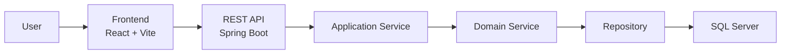

# 🎓 Club Management System

> A full-stack club management platform for student organizations and academic clubs.  
> The system supports member management, event organization, finance tracking, resource/document workflows, notifications, dashboard reporting, account management, and system settings.

<p align="center">
  
  
  
  
  
</p>

## 📚 Table of Contents

- [Overview](#-overview)
- [System Architecture](#-system-architecture)
- [Công nghệ sử dụng](#công-nghệ-sử-dụng)
- [Yêu cầu môi trường](#yêu-cầu-môi-trường)
- [Cấu trúc thư mục](#cấu-trúc-thư-mục)
- [Cài đặt và chạy project](#cài-đặt-và-chạy-project)
- [Tài khoản mẫu](#tài-khoản-mẫu)
- [Contributors](#-contributors)
- [License](#license)

## 📖 Overview

Club Management System is a modern full-stack application built for university clubs and student organizations.

The project focuses on solving common operational problems such as:

- Member registration, approval, search, filtering, and profile management
- Event creation, registration, attendance, organizer assignment, and evaluation
- Income, expense, revenue, and member due tracking
- Resource/document submission, review, approval, and file attachment workflows
- Notification delivery and recipient tracking
- Dashboard reporting, account management, and system settings

The architecture separates frontend and backend clearly for better scalability, maintainability, and testing.

## 🏗️ System Architecture



## Công nghệ sử dụng

### Backend

- Java 17
- Spring Boot 4.0.2
- Spring Data JPA
- SQL Server
- Maven Wrapper

### Frontend

- React 19
- Vite 7
- React Router
- Zustand
- TanStack Query
- Axios

## Yêu cầu môi trường

Cài đặt trước khi chạy project:

- Java Development Kit 17+
- Node.js 20+
- npm 10+
- SQL Server hoặc SQL Server Express
- Git

Kiểm tra phiên bản:

```bash
java -version
node -v
npm -v
git --version
```

## Cấu trúc thư mục

```text
SE104.Q21-club_management_system/
├── Backend/
│   ├── src/main/java/com/example/demo/
│   ├── src/main/resources/application.properties
│   ├── mvnw
│   ├── mvnw.cmd
│   └── pom.xml
├── Frontend/
│   ├── public/
│   ├── src/
│   ├── index.html
│   └── package.json
├── package.json
├── LICENSE
└── README.md
```

## Cài đặt và chạy project

### 1. Clone project

```bash
git clone https://github.com/ThankTran/club-management.git
cd club-management
```

Nếu đã có source code trên máy thì mở terminal tại thư mục gốc của project.

### 2. Tạo database

Mở SQL Server Management Studio hoặc công cụ SQL Server đang dùng, kết nối tới SQL Server local rồi chạy lệnh:

```sql
CREATE DATABASE clubmanage;
```

Backend đang cấu hình kết nối database trong:

```text
Backend/src/main/resources/application.properties
```

Cấu hình mặc định:

```properties
spring.datasource.url=jdbc:sqlserver://localhost:1433;databaseName=clubmanage;integratedSecurity=true;encrypt=true;trustServerCertificate=true;sendStringParametersAsUnicode=true
spring.datasource.driver-class-name=com.microsoft.sqlserver.jdbc.SQLServerDriver
spring.jpa.hibernate.ddl-auto=update
server.port=8081
```

Project dùng Windows Authentication với SQL Server. Nếu máy dùng tài khoản SQL Server riêng, cần sửa lại `spring.datasource.url`, `spring.datasource.username` và `spring.datasource.password` cho phù hợp.

### 3. Cài dependencies frontend

```bash
cd Frontend
npm install
```

### 4. Chạy backend

Mở terminal tại thư mục gốc project, sau đó chạy:

```powershell
cd Backend
.\mvnw.cmd spring-boot:run
```

Backend chạy tại:

```text
http://localhost:8081
```

Khi database trống, backend sẽ tự tạo bảng theo entity và thêm dữ liệu mẫu thông qua `SampleDataSeeder`.

### 5. Chạy frontend

Mở terminal khác tại thư mục gốc project, sau đó chạy:

```bash
cd Frontend
npm run dev
```

Frontend chạy tại:

```text
http://localhost:5173
```

## Tài khoản mẫu

Khi database trống, `SampleDataSeeder` tạo các tài khoản mẫu. Dùng `studentId` làm username đăng nhập.

| Vai trò | Tên | Username / Student ID | Password |
| --- | --- | --- | --- |
| Chủ nhiệm | Nguyễn Minh Anh | `22130001` | `President@123` |
| Phó chủ nhiệm | Trần Quốc Bảo | `22130002` | `VicePresident@123` |
| Trưởng ban học thuật | Lê Hoàng Nam | `22130003` | `AcademicHead@123` |
| Trưởng ban truyền thông | Phạm Gia Hân | `22130004` | `CommunicationHead@123` |
| Thành viên | Võ Đức Tài | `22130005` | `Member03@123` |
| Thành viên | Hoàng Trung Kiên | `22130006` | `Member04@123` |

Nếu database đã được seed trước đó, mật khẩu mới có thể không được cập nhật tự động vì seeder bỏ qua khi dữ liệu đã tồn tại. Khi cần seed lại, tạo database mới hoặc xóa dữ liệu cũ trước khi chạy backend.

# 🤝 Contributors

This project was developed by the following team members:

| Name | GitHub |
| --- | --- |
| Tran Thi Hong Thanh | [ThankTran](https://github.com/ThankTran) |
| Le Ngoc Minh Nhat | [Lenhat14810](https://github.com/Lenhat14810) |
| Nguyen Ai My | [aimynguyen](https://github.com/aimynguyen) |
| Pham Hoang Gia Hien | [hienpham0344](https://github.com/hienpham0344) |

## License

Project sử dụng MIT License. Xem chi tiết trong file [LICENSE](LICENSE).
